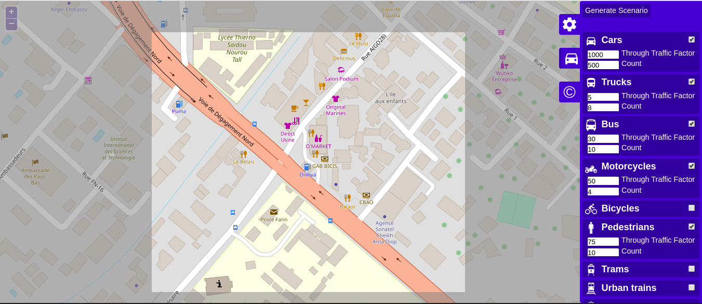

# Waterfall AI - Traffic Signal Control

A framework where a deep Q-Learning Reinforcement Learning agent tries to choose the correct traffic light phase at an intersection to maximize the traffic efficiency.

This project is based on __Andrea Vidali__'s [master thesis](Waterfall/thesis/780747_Vidali_tesi.pdf) on "*Simulation of a traffic light scenario controlled by a Deep Reinforcement Learning agent*".  
At the start of the challenge, I described the concept of the project in a [research paper](Waterfall/thesis/Collaborative_AI_Based_Traffic_Control_System.pdf) that was accepted at the NSRCSA 2020 (National Symposium on Research in Computer Science and its Applications) or [CNRIA](http://www.ascii.org.sn/index.php/activites/colloque/cnria) in French to the *"young researchers"* edition. Although my training is not research-oriented, I took the opportunity to get started and benefit from the advice of one of our teachers, [Mr. Diallo](http://edmi.ucad.sn/~moussadiallo), to write my first research paper.

## Getting Started

These instructions will get you a copy of the project up and running on your local machine for development and testing purposes. These are the easiest steps to follow in order to be able to run the algorithm starting from scratch. A computer with an NVIDA GPU is strongly recommended.

1. Download Anaconda ([official site](https://www.anaconda.com/distribution/#download-section)) and install.
2. Download SUMO ([official site](https://www.dlr.de/ts/en/desktopdefault.aspx/tabid-9883/16931_read-41000/)) and install.
3. Install dependences with the following command:
```
pip install -r requirements.txt
```

The following software versions were used: Python 3.7, SUMO traffic simulator 1.2.0, tensorflow 2.0  

## Testing the following scenario  

  
Launch the following command to view a case of heavy traffic in the Fann area in Dakar:
```
sumo-gui dakar/osm.sumocfg
```
This scenario was created using SUMO *OSM Web Wizard*.


## Running the algorithm

- Now you are ready to run the algorithm. To do so, you need to run the file **training_main.py** by executing the following simple command on the Anaconda prompt or any other terminal and the agent will start the training:
```
python training_main.py
```

You don't need to open any SUMO software, since everything it is loaded and done in the background. If you want to see the training process as it goes, you need to set to *True* the parameter *gui* contained in the file **training_settings.ini**. Keep in mind that viewing the simulation is very slow compared to the background training and you also need to close SUMO-GUI every time an episode ends, which is not practical.

The file **training_settings.ini** contains all the different parameters used by the agent in the simulation. The defualt parameters are not that optimized, so is very likely that a bit of testing will increase the current performance of the agent.

When the training ends, the results will be stored in "*./model/model_x/*" where *x* is an increasing integer starting from 1, generated automatically. Results will include some graphs, the data used to generate the graphs, the trained neural network and a copy of the ini file where the agent settings are.

Now you can finally test the trained agent. To do so, you will run the file **testing_main.py**. The test involve a single episode of simulation, and the results of the test will be stored in "*./model/model_x/test/*" where *x* is the number of the model that you specified to test. The number of the model to test and other useful parameters are contained in the file **testing_settings.ini**.

**Training time:** ~1mn 45seconds per episode, ~2hours for 100 episodes, on a computer equipped with Intel® Core™ i5-5200U CPU @ 2.20GHz × 4, 4GB RAM, Intel® HD Graphics 5500 (Broadwell GT2).

## The code structure

The main file is **training_main.py**. It basically handles the main loop that starts an episode on every iteration. At the end it saves the network and it also save 3 graphs: negative reward, cumulative wait time and average queues. 

Overall the algorithm is divided into classes that handle different part of the training.
- The **Model** class is used to define everything about the deep neural network and it also contains some functions used to train the network and predict the outputs. In the **model.py** file, two different **model** classes are defined: one used only during the training, one used only during the testing.
- The **Memory** class handle the memorization for the experience replay mechanism. A function is used to add a sample into the memory, while another function retrieves a batch of samples from the memory.
- The **Simulation** class handles the simulation. In particular, the function *run* allows the simulation of one episode. Also, some other functions are used during *run* in order to interact with SUMO, for example retrieving the state of the environment (*get_state*), set the next green light phase (*_set_green_phase*) or preprocess the data in order to train the neural network (*_replay*). There are two files that contain a slightly different **Simulation** class: **training_simulation.py** and **testing_simulation.py**. Which one is loaded depends of course if we are doing the training phase or the testing phase.
- The **TrafficGenerator** class contain the function dedicated to defining the route of every vehicle in one epsiode. The file created is *episode_routes.rou.xml* which is placed in the "intersection" folder.
- The **Visualization** class is just used for plotting data.
- In the **utils.py** file are contained some directory-related functions, such as automatically handle the creations of new model versions and the loading of existing models for the testing.

In the "intersection" folder there is a file called *environment.net.xml* which defines the structure of the environment, and it was created using SUMO NetEdit. The other file *sumo_config.sumocfg* it is basically a linker between the environment file and the route file. 

## Settings  

- The settings used during the __training__ are contained in the file **training_settings.ini**.
- The settings used during the __testing__ are contained in the file **testing_settings.ini**.  

## The Deep Q-Learning Agent

**Agent ( Traffic Signal Control System - TLCS)**:
- **State**: discretization of incoming lanes into presence cells, which identify the presence or absence of at least 1 vehicle inside them. There are 20 cells per arm. 10 of them are placed along the left-most lane while the others 10 are placed in the others three lane. 80 cells in the whole intersection.
- **Action**: choiche of the traffic light phase from a 4 possible predetermined phases, which are the described below. Every phase has a duration of 10 seconds. When the phase changes, a yellow phase of 4 seconds is activated.
  - North-South Advance: green for lanes in the north and south arm dedicated to turn right or go straight.
  - North-South Left Advance: green for lanes in the north and south arm dedicated to turn left. 
  - East-West Advance: green for lanes in the east and west arm dedicated to turn right or go straight.
  - East-West Left Advance: green for lanes in the east and west arm dedicated to turn left. 
- **Reward**: change in *cumulative waiting time* between actions, where the waiting time of a car is the number of seconds spent with speed=0 since the spawn; *cumulative* means that every waiting time of every car located in an incoming lane is summed. When a car leaves an incoming lane (i.e. crossed the intersection), its waiting time is not considered anymore, therefore is a positive reward for the agent.
- **Learning mechanism**: the agent make use of the Q-learning equation *Q(s,a) = reward + gamma • max Q'(s',a')* to update the action values and a deep neural network to learn the state-action function. The neural network is fully connected with 80 neurons as input (the state), 5 hidden layers of 400 neurons each and the output layers with 4 neurons representing the 4 possible actions. Also, a mechanism of experience replay is implemented: the experience of the agent is stored in a memory and, at the end of each episode, multiple batches of randomized samples are extracted from the memory and used to train the neural network once the action values has been updated with the Q-learning equation.

## License

This project is licensed under the MIT License - see the [LICENSE.md](LICENSE.md) file for details

